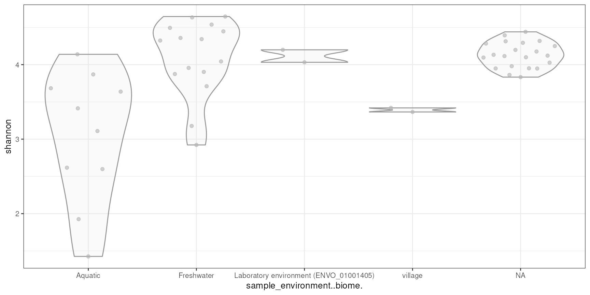
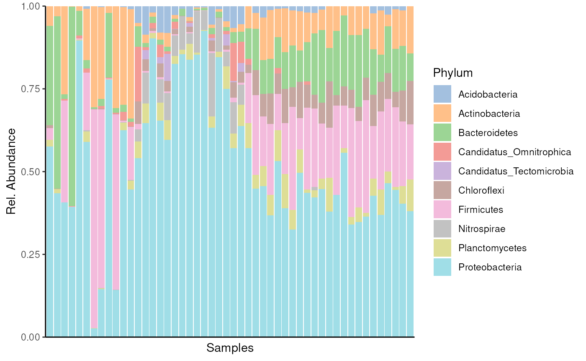
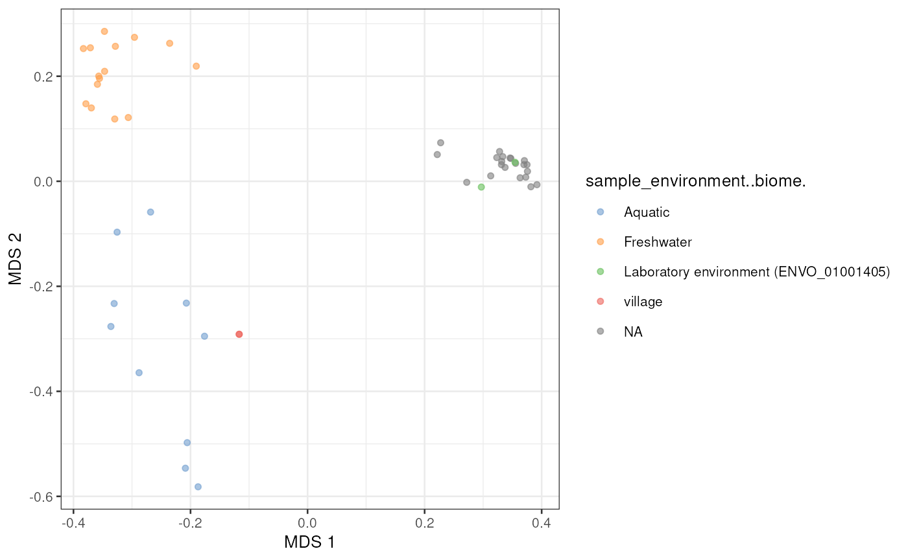

# MGnifyR

## Introduction

`MGnifyR` is a package designed to ease access to the EBI’s
[MGnify](https://www.ebi.ac.uk/metagenomics) resource, allowing
searching and retrieval of multiple datasets for downstream analysis.

The latest version of MGnifyR seamlessly integrates with the [miaverse
framework](https://microbiome.github.io/) providing access to
cutting-edge tools in microbiome down-stream analytics.

## Installation

`MGnifyR` is hosted on Bioconductor, and can be installed using via
`BiocManager`.

``` r

BiocManager::install("MGnifyR")
```

## Load `MGnifyR` package

Once installed, `MGnifyR` is made available in the usual way.

``` r

library(MGnifyR)
#> Loading required package: MultiAssayExperiment
#> Loading required package: SummarizedExperiment
#> Loading required package: MatrixGenerics
#> Loading required package: matrixStats
#> 
#> Attaching package: 'MatrixGenerics'
#> The following objects are masked from 'package:matrixStats':
#> 
#>     colAlls, colAnyNAs, colAnys, colAvgsPerRowSet, colCollapse,
#>     colCounts, colCummaxs, colCummins, colCumprods, colCumsums,
#>     colDiffs, colIQRDiffs, colIQRs, colLogSumExps, colMadDiffs,
#>     colMads, colMaxs, colMeans2, colMedians, colMins, colOrderStats,
#>     colProds, colQuantiles, colRanges, colRanks, colSdDiffs, colSds,
#>     colSums2, colTabulates, colVarDiffs, colVars, colWeightedMads,
#>     colWeightedMeans, colWeightedMedians, colWeightedSds,
#>     colWeightedVars, rowAlls, rowAnyNAs, rowAnys, rowAvgsPerColSet,
#>     rowCollapse, rowCounts, rowCummaxs, rowCummins, rowCumprods,
#>     rowCumsums, rowDiffs, rowIQRDiffs, rowIQRs, rowLogSumExps,
#>     rowMadDiffs, rowMads, rowMaxs, rowMeans2, rowMedians, rowMins,
#>     rowOrderStats, rowProds, rowQuantiles, rowRanges, rowRanks,
#>     rowSdDiffs, rowSds, rowSums2, rowTabulates, rowVarDiffs, rowVars,
#>     rowWeightedMads, rowWeightedMeans, rowWeightedMedians,
#>     rowWeightedSds, rowWeightedVars
#> Loading required package: GenomicRanges
#> Loading required package: stats4
#> Loading required package: BiocGenerics
#> Loading required package: generics
#> 
#> Attaching package: 'generics'
#> The following objects are masked from 'package:base':
#> 
#>     as.difftime, as.factor, as.ordered, intersect, is.element, setdiff,
#>     setequal, union
#> 
#> Attaching package: 'BiocGenerics'
#> The following objects are masked from 'package:stats':
#> 
#>     IQR, mad, sd, var, xtabs
#> The following objects are masked from 'package:base':
#> 
#>     anyDuplicated, aperm, append, as.data.frame, basename, cbind,
#>     colnames, dirname, do.call, duplicated, eval, evalq, Filter, Find,
#>     get, grep, grepl, is.unsorted, lapply, Map, mapply, match, mget,
#>     order, paste, pmax, pmax.int, pmin, pmin.int, Position, rank,
#>     rbind, Reduce, rownames, sapply, saveRDS, table, tapply, unique,
#>     unsplit, which.max, which.min
#> Loading required package: S4Vectors
#> 
#> Attaching package: 'S4Vectors'
#> The following object is masked from 'package:utils':
#> 
#>     findMatches
#> The following objects are masked from 'package:base':
#> 
#>     expand.grid, I, unname
#> Loading required package: IRanges
#> Loading required package: Seqinfo
#> Loading required package: Biobase
#> Welcome to Bioconductor
#> 
#>     Vignettes contain introductory material; view with
#>     'browseVignettes()'. To cite Bioconductor, see
#>     'citation("Biobase")', and for packages 'citation("pkgname")'.
#> 
#> Attaching package: 'Biobase'
#> The following object is masked from 'package:MatrixGenerics':
#> 
#>     rowMedians
#> The following objects are masked from 'package:matrixStats':
#> 
#>     anyMissing, rowMedians
#> Loading required package: TreeSummarizedExperiment
#> Loading required package: SingleCellExperiment
#> Loading required package: Biostrings
#> Loading required package: XVector
#> 
#> Attaching package: 'Biostrings'
#> The following object is masked from 'package:base':
#> 
#>     strsplit
```

## Create a client

All functions in `MGnifyR` make use of a `MgnifyClient` object to keep
track of the JSONAPI url, disk cache location and user access tokens.
Thus the first thing to do when starting any analysis is to instantiate
this object. The following snippet creates this.

``` r

mg <- MgnifyClient(useCache = TRUE)
mg
#> An object of class "MgnifyClient"
#> Slot "databaseUrl":
#> [1] "https://www.ebi.ac.uk/metagenomics/api/v1"
#> 
#> Slot "authTok":
#> [1] NA
#> 
#> Slot "useCache":
#> [1] TRUE
#> 
#> Slot "cacheDir":
#> [1] "/tmp/RtmpweaDEy/.MGnifyR_cache"
#> 
#> Slot "showWarnings":
#> [1] FALSE
#> 
#> Slot "clearCache":
#> [1] FALSE
#> 
#> Slot "verbose":
#> [1] TRUE
```

The `MgnifyClient` object contains slots for each of the previously
mentioned settings.

## Functions for fetching the data

### Search data

[`doQuery()`](../reference/doQuery.md) function can be utilized to
search results such as samples and studies from MGnify database. Below,
we fetch information drinking water samples.

``` r

# Fetch studies
samples <- doQuery(
    mg,
    type = "samples",
    biome_name = "root:Environmental:Aquatic:Freshwater:Drinking water",
    max.hits = 10)
```

The result is a table containing accession IDs and description – in this
case – on samples.

``` r

colnames(samples) |> head()
#> [1] "biosample"            "accession"            "sample-desc"         
#> [4] "environment-biome"    "environment-feature"  "environment-material"
```

### Find relevent **analyses** accessions

Now we want to find analysis accessions. Each sample might have multiple
analyses. Each analysis ID corresponds to a single run of a particular
pipeline on a single sample in a single study.

``` r

analyses_accessions <- searchAnalysis(mg, "samples", samples$accession)
```

By running the [`searchAnalysis()`](../reference/searchAnalysis.md)
function, we get a vector of analysis IDs of samples that we fed as an
input.

``` r

analyses_accessions |> head()
#> [1] "MGYA00652201" "MGYA00652185" "MGYA00643487" "MGYA00643486" "MGYA00643485"
#> [6] "MGYA00643484"
```

### Fetch metadata

We can now check the metadata to get hint of what kind of data we have.
We use [`getMetadata()`](../reference/getMetadata.md) function to fetch
data based on analysis IDs.

``` r

analyses_metadata <- getMetadata(mg, analyses_accessions)
```

The returned value is a `data.frame` that includes metadata for example
on how analysis was conducted and what kind of samples were analyzed.

``` r

colnames(analyses_metadata) |> head()
#> [1] "analysis_analysis-status"  "analysis_pipeline-version"
#> [3] "analysis_experiment-type"  "analysis_accession"       
#> [5] "analysis_is-private"       "analysis_complete-time"
```

### Fetch microbiome data

After we have selected the data to fetch, we can use
[`getResult()`](../reference/getResult.md)

The output is
*[TreeSummarizedExperiment](https://bioconductor.org/packages/3.23/TreeSummarizedExperiment)*
(`TreeSE`) or
*[MultiAssayExperiment](https://bioconductor.org/packages/3.23/MultiAssayExperiment)*
(`MAE`) depending on the dataset. If the dataset includes only taxonomic
profiling data, the output is a single `TreeSE`. If dataset includes
also functional data, the output is multiple `TreeSE` objects that are
linked together by utilizing `MAE`.

``` r

mae <- getResult(mg, accession = analyses_accessions)
```

``` r

mae
#> A MultiAssayExperiment object of 6 listed
#>  experiments with user-defined names and respective classes.
#>  Containing an ExperimentList class object of length 6:
#>  [1] microbiota: TreeSummarizedExperiment with 3506 rows and 50 columns
#>  [2] go-slim: TreeSummarizedExperiment with 116 rows and 38 columns
#>  [3] go-terms: TreeSummarizedExperiment with 3133 rows and 38 columns
#>  [4] interpro-identifiers: TreeSummarizedExperiment with 18223 rows and 38 columns
#>  [5] taxonomy: TreeSummarizedExperiment with 3617 rows and 50 columns
#>  [6] taxonomy-lsu: TreeSummarizedExperiment with 3378 rows and 42 columns
#> Functionality:
#>  experiments() - obtain the ExperimentList instance
#>  colData() - the primary/phenotype DataFrame
#>  sampleMap() - the sample coordination DataFrame
#>  `$`, `[`, `[[` - extract colData columns, subset, or experiment
#>  *Format() - convert into a long or wide DataFrame
#>  assays() - convert ExperimentList to a SimpleList of matrices
#>  exportClass() - save data to flat files
```

You can get access to individual `TreeSE` object in `MAE` by specifying
index or name.

``` r

mae[[1]]
#> class: TreeSummarizedExperiment 
#> dim: 3506 50 
#> metadata(0):
#> assays(1): counts
#> rownames(3506): 82608 62797 ... 5820 6794
#> rowData names(9): Kingdom Phylum ... taxonomy1 taxonomy
#> colnames(50): MGYA00144458 MGYA00144419 ... MGYA00652185 MGYA00652201
#> colData names(64): analysis_analysis.status analysis_pipeline.version
#>   ... sample_geo.loc.name sample_instrument.model
#> reducedDimNames(0):
#> mainExpName: NULL
#> altExpNames(0):
#> rowLinks: NULL
#> rowTree: NULL
#> colLinks: NULL
#> colTree: NULL
```

`TreeSE` object is uniquely positioned to support
`SummarizedExperiment`-based microbiome data manipulation and
visualization. Moreover, it enables access to `miaverse` tools. For
example, we can estimate diversity of samples…

``` r

library(mia)
#> This is mia version 1.19.2
#> - Online documentation and vignettes: https://microbiome.github.io/mia/
#> - Online book 'Orchestrating Microbiome Analysis (OMA)': https://microbiome.github.io/OMA/docs/devel/

mae[[1]] <- estimateDiversity(mae[[1]], index = "shannon")
#> Warning in estimateDiversity(mae[[1]], index = "shannon"): 'estimateDiversity'
#> is deprecated. Use 'addAlpha' instead.

library(scater)
#> Loading required package: scuttle
#> Loading required package: ggplot2

plotColData(mae[[1]], "shannon", x = "sample_environment..biome.")
```



… and plot abundances of most abundant phyla.

``` r

# Agglomerate data
altExps(mae[[1]]) <- splitByRanks(mae[[1]])

library(miaViz)
#> Loading required package: ggraph
#> 
#> Attaching package: 'miaViz'
#> The following object is masked from 'package:mia':
#> 
#>     plotNMDS

# Plot top taxa
top_taxa <- getTopFeatures(altExp(mae[[1]], "Phylum"), 10)
#> Warning in getTopFeatures(altExp(mae[[1]], "Phylum"), 10): 'getTopFeatures' is
#> deprecated. Use 'getTop' instead.
plotAbundance(
    altExp(mae[[1]], "Phylum")[top_taxa, ],
    rank = "Phylum",
    as.relative = TRUE
    )
#> Warning: The following values are already present in `metadata` and will be
#> overwritten: 'agglomerated_by_rank'. Consider using the 'name' argument to
#> specify alternative names.
#> Warning: Removed 107 rows containing missing values or values outside the scale range
#> (`geom_bar()`).
```



We can also perform other analyses such as principal component analysis
to microbial profiling data by utilizing miaverse tools.

``` r

# Apply relative transformation
mae[[1]] <- transformAssay(mae[[1]], method = "relabundance")
# Perform PCoA
mae[[1]] <- runMDS(
    mae[[1]], assay.type = "relabundance",
    FUN = vegan::vegdist, method = "bray")
# Plot
plotReducedDim(
    mae[[1]], "MDS", colour_by = "sample_environment..biome.")
```



### Fetch raw files

While [`getResult()`](../reference/getResult.md) can be utilized to
retrieve microbial profiling data,
[`getData()`](../reference/getData.md) can be used more flexibly to
retrieve any kind of data from the database. It returns data as simple
data.frame or list format.

``` r

publications <- getData(mg, type = "publications")
```

``` r

colnames(publications) |> head()
#> [1] "document.id"                  "type"                        
#> [3] "id"                           "attributes.pubmed-id"        
#> [5] "attributes.pubmed-central-id" "attributes.pub-title"
```

The result is a `data.frame` by default. In this case, it includes
information on publications fetched from the data portal.

### Fetch sequence files

Finally, we can use [`searchFile()`](../reference/getFile.md) and
[`getFile()`](../reference/getFile.md) to retrieve other MGnify pipeline
outputs such as merged sequence reads, assembled contigs, and details of
the functional analyses.

With [`searchFile()`](../reference/getFile.md), we can search files from
the database.

``` r

dl_urls <- searchFile(mg, analyses_accessions, type = "analyses")
```

The returned table contains search results related to analyses that we
fed as an input. The table contains information on file and also URL
address from where the file can be loaded.

``` r

target_urls <- dl_urls[
    dl_urls$attributes.description.label == "Predicted alpha tmRNA", ]

colnames(target_urls) |> head()
#> [1] "type"                               "id"                                
#> [3] "attributes.alias"                   "attributes.file.format.name"       
#> [5] "attributes.file.format.extension"   "attributes.file.format.compression"
```

Finally, we can download the files with
[`getFile()`](../reference/getFile.md).

``` r

# Just select a single file from the target_urls list for demonstration.
file_url <- target_urls$download_url[[1]]
cached_location <- getFile(mg, file_url)
```

The function returns a path where the file is stored.

``` r

# Where are the files?
cached_location
#> [1] "/.MGnifyR_cache/analyses/MGYA00652201/file/ERZ20300939_alpha_tmRNA.RF01849.fasta.gz"
```

``` r

sessionInfo()
#> R Under development (unstable) (2026-01-03 r89269)
#> Platform: x86_64-pc-linux-gnu
#> Running under: Ubuntu 24.04.3 LTS
#> 
#> Matrix products: default
#> BLAS:   /usr/lib/x86_64-linux-gnu/openblas-pthread/libblas.so.3 
#> LAPACK: /usr/lib/x86_64-linux-gnu/openblas-pthread/libopenblasp-r0.3.26.so;  LAPACK version 3.12.0
#> 
#> locale:
#>  [1] LC_CTYPE=en_US.UTF-8       LC_NUMERIC=C              
#>  [3] LC_TIME=en_US.UTF-8        LC_COLLATE=en_US.UTF-8    
#>  [5] LC_MONETARY=en_US.UTF-8    LC_MESSAGES=en_US.UTF-8   
#>  [7] LC_PAPER=en_US.UTF-8       LC_NAME=C                 
#>  [9] LC_ADDRESS=C               LC_TELEPHONE=C            
#> [11] LC_MEASUREMENT=en_US.UTF-8 LC_IDENTIFICATION=C       
#> 
#> time zone: UTC
#> tzcode source: system (glibc)
#> 
#> attached base packages:
#> [1] stats4    stats     graphics  grDevices utils     datasets  methods  
#> [8] base     
#> 
#> other attached packages:
#>  [1] miaViz_1.19.1                   ggraph_2.2.2                   
#>  [3] scater_1.39.1                   ggplot2_4.0.1                  
#>  [5] scuttle_1.21.0                  mia_1.19.2                     
#>  [7] MGnifyR_1.7.0                   TreeSummarizedExperiment_2.19.0
#>  [9] Biostrings_2.79.4               XVector_0.51.0                 
#> [11] SingleCellExperiment_1.33.0     MultiAssayExperiment_1.37.2    
#> [13] SummarizedExperiment_1.41.0     Biobase_2.71.0                 
#> [15] GenomicRanges_1.63.1            Seqinfo_1.1.0                  
#> [17] IRanges_2.45.0                  S4Vectors_0.49.0               
#> [19] BiocGenerics_0.57.0             generics_0.1.4                 
#> [21] MatrixGenerics_1.23.0           matrixStats_1.5.0              
#> [23] knitr_1.51                      BiocStyle_2.39.0               
#> 
#> loaded via a namespace (and not attached):
#>   [1] RColorBrewer_1.1-3          jsonlite_2.0.0             
#>   [3] magrittr_2.0.4              ggbeeswarm_0.7.3           
#>   [5] farver_2.1.2                rmarkdown_2.30             
#>   [7] fs_1.6.6                    ragg_1.5.0                 
#>   [9] vctrs_0.6.5                 memoise_2.0.1              
#>  [11] DelayedMatrixStats_1.33.0   ggtree_4.1.1               
#>  [13] htmltools_0.5.9             S4Arrays_1.11.1            
#>  [15] BiocBaseUtils_1.13.0        BiocNeighbors_2.5.0        
#>  [17] janeaustenr_1.0.0           gridGraphics_0.5-1         
#>  [19] SparseArray_1.11.10         sass_0.4.10                
#>  [21] bslib_0.9.0                 tokenizers_0.3.0           
#>  [23] htmlwidgets_1.6.4           desc_1.4.3                 
#>  [25] plyr_1.8.9                  DECIPHER_3.7.0             
#>  [27] cachem_1.1.0                igraph_2.2.1               
#>  [29] lifecycle_1.0.5             pkgconfig_2.0.3            
#>  [31] rsvd_1.0.5                  Matrix_1.7-4               
#>  [33] R6_2.6.1                    fastmap_1.2.0              
#>  [35] tidytext_0.4.3              aplot_0.2.9                
#>  [37] digest_0.6.39               ggnewscale_0.5.2           
#>  [39] patchwork_1.3.2             irlba_2.3.5.1              
#>  [41] SnowballC_0.7.1             textshaping_1.0.4          
#>  [43] vegan_2.7-2                 beachmat_2.27.1            
#>  [45] labeling_0.4.3              urltools_1.7.3.1           
#>  [47] httr_1.4.7                  polyclip_1.10-7            
#>  [49] abind_1.4-8                 mgcv_1.9-4                 
#>  [51] compiler_4.6.0              fontquiver_0.2.1           
#>  [53] withr_3.0.2                 S7_0.2.1                   
#>  [55] BiocParallel_1.45.0         viridis_0.6.5              
#>  [57] DBI_1.2.3                   ggforce_0.5.0              
#>  [59] MASS_7.3-65                 rappdirs_0.3.3             
#>  [61] DelayedArray_0.37.0         bluster_1.21.0             
#>  [63] permute_0.9-8               tools_4.6.0                
#>  [65] vipor_0.4.7                 otel_0.2.0                 
#>  [67] beeswarm_0.4.0              ape_5.8-1                  
#>  [69] glue_1.8.0                  nlme_3.1-168               
#>  [71] grid_4.6.0                  cluster_2.1.8.1            
#>  [73] reshape2_1.4.5              gtable_0.3.6               
#>  [75] tidyr_1.3.2                 BiocSingular_1.27.1        
#>  [77] tidygraph_1.3.1             ScaledMatrix_1.19.0        
#>  [79] ggrepel_0.9.6               pillar_1.11.1              
#>  [81] stringr_1.6.0               yulab.utils_0.2.3          
#>  [83] splines_4.6.0               dplyr_1.1.4                
#>  [85] tweenr_2.0.3                treeio_1.35.0              
#>  [87] lattice_0.22-7              tidyselect_1.2.1           
#>  [89] DirichletMultinomial_1.53.0 fontLiberation_0.1.0       
#>  [91] fontBitstreamVera_0.1.1     gridExtra_2.3              
#>  [93] bookdown_0.46               xfun_0.55                  
#>  [95] graphlayouts_1.2.2          stringi_1.8.7              
#>  [97] ggfun_0.2.0                 lazyeval_0.2.2             
#>  [99] yaml_2.3.12                 evaluate_1.0.5             
#> [101] codetools_0.2-20            gdtools_0.4.4              
#> [103] tibble_3.3.0                BiocManager_1.30.27        
#> [105] ggplotify_0.1.3             cli_3.6.5                  
#> [107] systemfonts_1.3.1           jquerylib_0.1.4            
#> [109] Rcpp_1.1.0.8.2              triebeard_0.4.1            
#> [111] parallel_4.6.0              pkgdown_2.2.0              
#> [113] ecodive_2.2.1               sparseMatrixStats_1.23.0   
#> [115] decontam_1.31.0             viridisLite_0.4.2          
#> [117] tidytree_0.4.7              ggiraph_0.9.2              
#> [119] scales_1.4.0                purrr_1.2.0                
#> [121] crayon_1.5.3                rlang_1.1.6
```
